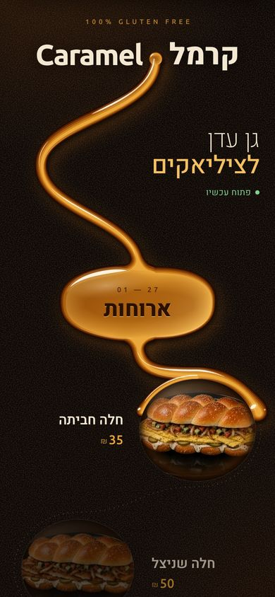
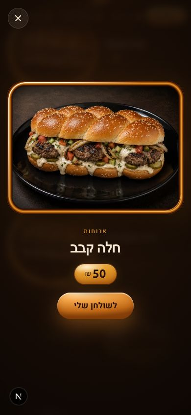
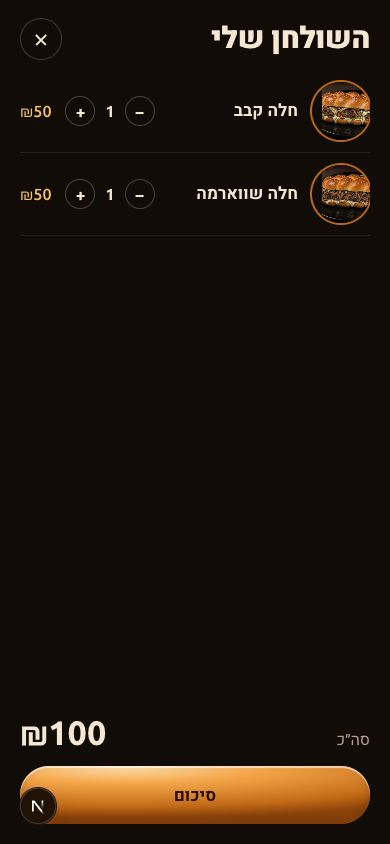
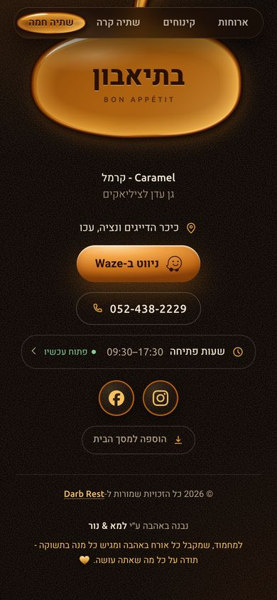
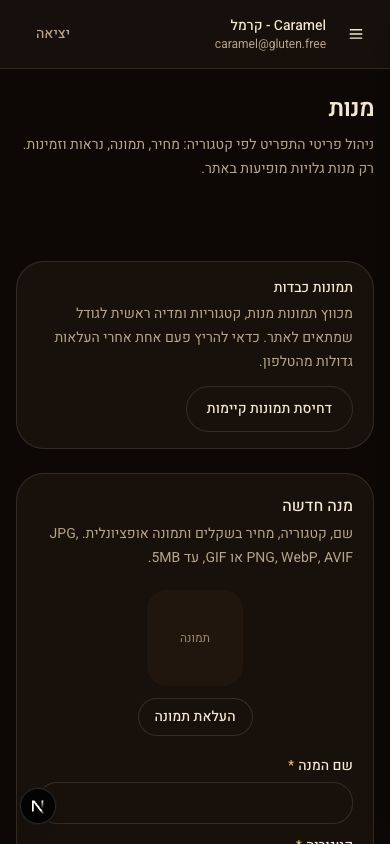

# Caramel · The Pour

A restaurant menu that is not a list. A ribbon of liquid caramel pours down the page as the guest scrolls, wraps each dish and lights it up. Built for one real restaurant (Caramel, a gluten-free kitchen in Akko) and designed as the first concept of a menu-experience platform.

**Live:** [caramel.darb.co.il](https://caramel.darb.co.il)

<p>
  
  
  
  
  
  
</p>

## What it does

**For guests (mobile first, Hebrew RTL):**

- One continuous scene instead of pages and cards: the caramel stream is laid through the menu, each dish sits in a caramel ring, each category is a pool, and the whole thing responds to native scroll with a viscous lag.
- Tap a dish to open it; add it to "my table"; a summary view in large print for showing the waiter. The table survives reloads and is reconciled against the live menu.
- Address, Waze, phone, collapsed opening hours with open/closed state, social links.
- Installable PWA: the last menu seen opens offline, with a banner that prices may be out of date.

**For the restaurant (admin portal):** profile, categories, dishes with photos and availability, opening hours with overnight intervals, social links, SEO copy. Server actions behind Supabase Row Level Security; the browser never sees a privileged key.

**Nothing restaurant-specific lives in components.** Content comes from PostgreSQL, interface text from `lib/i18n` (Hebrew, Arabic, English), brand values from `config/site.ts`, and the caramel itself from `config/pour-theme.ts`. Swapping the theme's colours turns the pour into olive oil or chocolate for the next restaurant.

## Engineering highlights

### The pour engine (`features/pour/engine`)

- **Framework-free kernel.** `pour.js` receives DOM elements, a theme and callbacks, and returns `{ destroy, relayout, categoryTop }`. React (`pour-stage.tsx`) renders the semantic list on the server and only enhances it. The painter (`createPainter`) is shared with the splash and the category pill, so every caramel surface in the app is the same material.
- **Path layout.** The stream is a sampled polyline with normals; dishes are arcs on it, categories are organic blobs. Positions are computed per viewport width and written to the DOM once per layout.
- **Static strips plus a moving head.** The caramel below the pour front is painted once into 1024px canvas strips and revealed with compositor-only clips; only the last stretch and the drip head are redrawn per frame. The follow is a pair of exponential followers plus a slow one that makes the last pixels ooze in (`math.ts`, unit tested).
- **Progressive by design.** Without scripts, or if the engine throws (for example canvas memory limits on long menus), the page falls back to a plain, fully lit list through CSS keyed on a single attribute. Reduced motion shows the whole stream poured and every dish lit.

### Media

- Dish photos go through `next/image` as WebP with sizes matched to real use; ring photos load eagerly so nothing arrives late while scrolling; the dialog shows the already-loaded ring photo instantly and prefetches the large one as dishes light up.
- Dishes without a photo get a lettered caramel ring; a photo that fails falls back to the same.

### PWA

- Service worker with explicit rules: menu page network-first with the last complete copy as fallback (a backend hiccup never replaces it), build assets stale-while-revalidate, optimised images cache-first with a cap, admin and auth never cached. On the first visit the page hands the worker what it already loaded, so offline works without a second visit.
- Install is offered as a quiet link in the page's ending, not a banner.

### Typography and i18n

- Three scripts, three faces: Ubuntu for Latin and numbers, Heebo for Hebrew, Cairo for Arabic, resolved by unicode range rather than per-element rules. One subtle bug worth knowing: `next/font` attaches a synthetic Arial-based fallback to each face, and that fallback owns Hebrew glyphs, so an "Ubuntu, Heebo" stack never reached Heebo until Ubuntu was pinned to its Latin face.
- Dictionaries are checked by a test for identical keys across locales; prices are formatted with `Intl.NumberFormat`.

### Security and data

- Supabase with RLS on every table and storage bucket; public reads additionally require an active restaurant profile; admin membership lives in a private schema and is checked server-side.
- Open redirects blocked on auth flows; admin and auth routes are `noindex` and never cached by the worker.

## Stack

Next.js 16 (App Router, Server Components), React 19, TypeScript (strict), Tailwind CSS v4, Supabase (PostgreSQL, Auth, Storage), Vitest, Playwright for browser checks, Vercel.

## Project structure

```
app/                      routes: (public) menu, admin portal, auth callbacks, manifest, sitemap
features/pour/            the public experience
  engine/                 pour.js (layout, painter, motion), math.ts, types
  table/                  "my table" reducer, reconciliation, storage
  pour-menu.tsx           server-rendered semantic page
  pour-stage.tsx          client: mounts the engine, owns table and dialog state
  category-nav.tsx        sticky pill with the caramel pool
  dish-dialog.tsx         expanded dish
  my-table.tsx            pill, sheet, summary view
  ending.tsx              directions, hours, social, credit, dedication
  splash.tsx              the first pour
features/admin/           admin editors and server actions
services/                 read models (public home, SEO, admin dashboard)
lib/                      domain helpers: opening hours, prices, i18n, SEO, Supabase clients
config/                   site, pour theme, routes, storage buckets
styles/                   globals.css (tokens shared by admin and public), pour.css
public/sw.js              service worker
supabase/migrations/      schema, RLS, storage policies
docs/superpowers/         design spec, implementation plan, reference prototype
```

## Running locally

Requirements: Node.js 20.9 or newer.

```bash
npm install
cp .env.example .env.local   # NEXT_PUBLIC_SITE_URL, NEXT_PUBLIC_SUPABASE_URL, NEXT_PUBLIC_SUPABASE_PUBLISHABLE_KEY
npm run dev
```

The public menu needs no session. The admin portal is at `/portal`; the first admin is bootstrapped by inserting an Auth user id into `private.admin_users`.

Service workers register only in production: `npm run build && npm run start`, then test on localhost or over HTTPS.

Database: migrations are under `supabase/migrations/`; `npm run db:start`, `db:reset`, `db:types` work against the local Supabase stack, `db:types:linked` against a linked project.

## Quality

```bash
npm run lint        # eslint, next core-web-vitals + typescript
npm run typecheck   # tsc --noEmit, strict with noUncheckedIndexedAccess
npm test            # vitest: pour motion maths, table logic, price parts, dictionaries
npm run build
```

Browser checks are run with Playwright against a production build at 320, 390 and 1280px wide, in Chromium and WebKit, including no-script, reduced-motion and offline passes.

## How it was built

The concept was chosen from a set of interactive prototypes tested on a phone (a conveyor belt, a deck of cards, a printed receipt, a 3D drum, and the pour, among others), then specified before implementation: `docs/superpowers/specs/2026-10-02-pour-menu-design.md` is the design, `docs/superpowers/plans/2026-10-02-pour-menu.md` the plan, and `docs/superpowers/specs/2026-10-02-pour-prototype.html` the approved prototype whose arithmetic the engine keeps exactly.

## Roadmap

- Ordering and table numbers, built on "my table".
- Ten more menu concepts and a catalogue page where a restaurant owner picks the concept for their business (the Darb Rest platform).
- Translated dish content.

## Credits

Built with love by Lama & Nour · [Darb Rest](https://darb.co.il)
